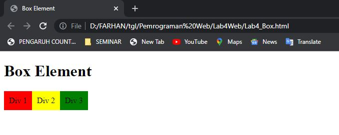
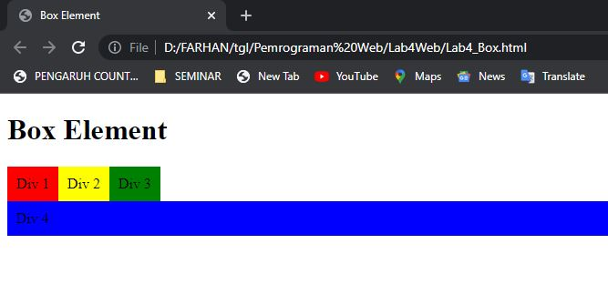

# Lab4Web
**CSS LAYOUT** 

**MUHAMMAD FARHAN ALFARIZI** 
**312010210 - TI.20.B1**

<b>1.MEMBUAT BOX ELEMENT 

Langkah pertama buatlah box element dengan tag div seperti berikut.

<b>2.Mengatur Clearfix Element 

Clearfix digunakan untuk mengatur element setelah float element. Property clear digunakan untuk 
mengaturnya. 

<b>3. 
